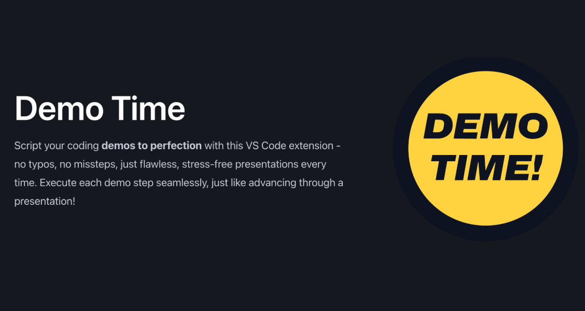

# Demo Time - Documentation



[Demo Time](https://marketplace.visualstudio.com/items?itemName=eliostruyf.vscode-demo-time) is a Visual Studio Code extension that allows you to create and run demos directly from your editor. It is a great tool to use when you are presenting or creating content.

In this `repository`, you can find the documentation for the extension. It contains all the information you need to get started with the extension and how to use it.

> **Note**: The extension is available on the [Visual Studio Code Marketplace](https://marketplace.visualstudio.com/items?itemName=eliostruyf.vscode-demo-time).

```json
{
  "name": "Demo Time",
  "version": "1.0.0",
  "publisher": "eliostruyf"
}
```

# Heading 1

## Heading 2

### Heading 3

#### Heading 4